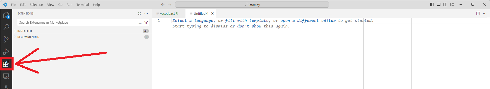
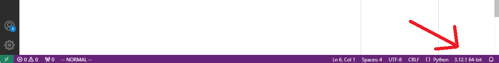

====================================
Set up Visual Studio Code for Python
====================================

Here's *my* setup of VS Code. Your milage may vary, depending on your preferred
work flow, especially if you are using Jupyter Notebooks (I mostly don't).

This overview assumes that you are using Windows. Unless stated otherwise,
you do not need admin privileges.

TL;DR
=====

1. Install `Python <https://www.python.org/downloads/>`_
2. ``pip install numpy matplotlib scipy uproot``
3. Install `VS Code <https://code.visualstudio.com/>`_
4. Open your ``*.py`` file and press ``CTRL-F5``.

Step 1: Install Python
======================

Get the `latest version of Python <https://www.python.org/downloads/>`_
and install it. Make sure to add the executable to your system's ``PATH``.

It is useful to install some Python packages globally (i.e., not in a
virtual environment), so that they are available for every Python project
on your machine.

I usually install:

- `numpy <https://numpy.org/>`_
- `matplotlib <https://matplotlib.org/>`_
- `scipy <https://scipy.org/>`_
- `uproot <https://uproot.readthedocs.io/en/latest/basic.html>`_

To install these, just run in any shell

.. code:: shell

    pip install <package>

You could also install ``atompy`` globally, but I kinda advise against it
(see :ref:`installation` for all the other methods).

Step 2: Install Visual Studio Code
==================================

Get the `latest version of VS Code <https://code.visualstudio.com/>`_ and
install it.

Start VS Code and open the Extensions Pane:

At least install the ``Python`` and ``PythonDebugger`` extensions.

Now, when you open a Python script you may be asked to select your Python
interpreter. Select the one that you installed in Step 1.

After doing so, it should appear in the bottom right corner of VS Code.

If not, you can tell VS Code where your default Python interpreter is
installed:

- Open ``File->Preferences->Settings`` (or ``CTRL`` + ``,``).
- In the top-right corner, click on ``Open Settings (JSON)``.
- Add the line ``"python.defaultInterpreterPath": "path-to\\python.exe",``

You should now be able to run your Python script by pressing ``CTRL`` + ``F5``.
If you want to debug the script, press ``F5``.

Useful Settings
---------------
Below some settings that you can put in ``settings.json``.
VS Code auto-complete should give a decent overview of the different options
of the settings.

Python
******

.. code:: json

    "python.terminal.executeInFileDir": true,
    "python.analysis.typeCheckingMode": "basic",
    "[python]": {
        "editor.insertSpaces": true,
        "editor.formatOnSave": false,
         "editor.formatOnType": false,
        "editor.defaultFormatter": "ms-python.autopep8",
    },

VIM
***

Assuming you installed the ``vscodevim`` extension.

.. code:: json

    "vim.useSystemClipboard": false,
    "vim.vimrc.enable": true,
    "vim.highlightedyank.enable": true,

General
*******

.. code:: json

    "editor.autoClosingBrackets": "never",
    "editor.autoClosingQuotes": "never",
    "editor.rulers": [
        80,
        100
    ],
    "editor.lineNumbers": "relative",
    "editor.indentSize": "tabSize",
    "editor.inlayHints.enabled": "offUnlessPressed",
    "editor.cursorSurroundingLines": 10,
    "workbench.panel.defaultLocation": "bottom",
    "workbench.panel.opensMaximized": "preserve",

Move cache directory
--------------------
By default, VS Code stores cache and similar files in the ``%AppData%`` folder
(``C:\Users\<username>\AppData\Roaming``). Unfortunate if your account is
actually synced in a network (since VS Code may create hundreds of thousands
of cache files, syncing them can take for-ever).

As of 2024, I don't know any method how to change the location. But one can
change the actual location using
`symbolic links <https://learn.microsoft.com/en-us/windows-server/administration/windows-commands/mklink>`_,
as outlined
on `stackoverflow <https://stackoverflow.com/questions/74657413/vs-code-move-cache-location-in-windows>`_.

Step 3: Install a PDF reader
============================

This is optional, but part of my workflow.

In particular, install a PDF reader that doesn't lock the opened file as
read-only.

If you do so, you can save your ``matplotlib`` figures in a PDF, open it
using such a reader. Then, after you edit the figure and save the changes,
the updates are continously updated in the PDF editor.

At least, if you use either the VS Code build-in PDF reader (see extensions),
or `Sumatra PDF <https://www.sumatrapdfreader.org/free-pdf-reader>`_.

There are other ways. But this is mine.